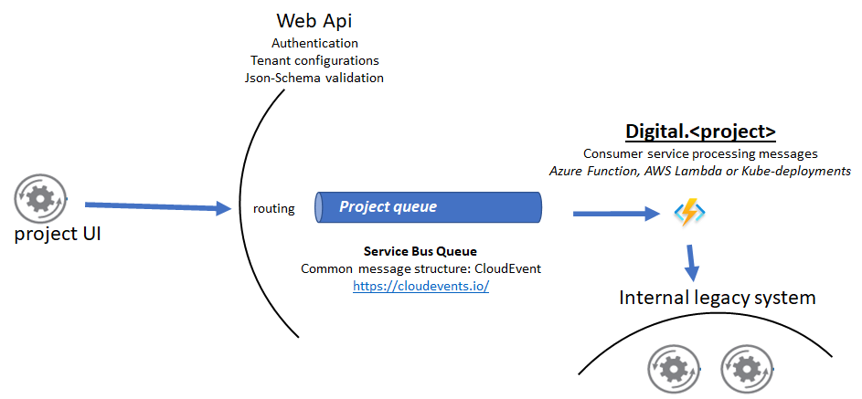
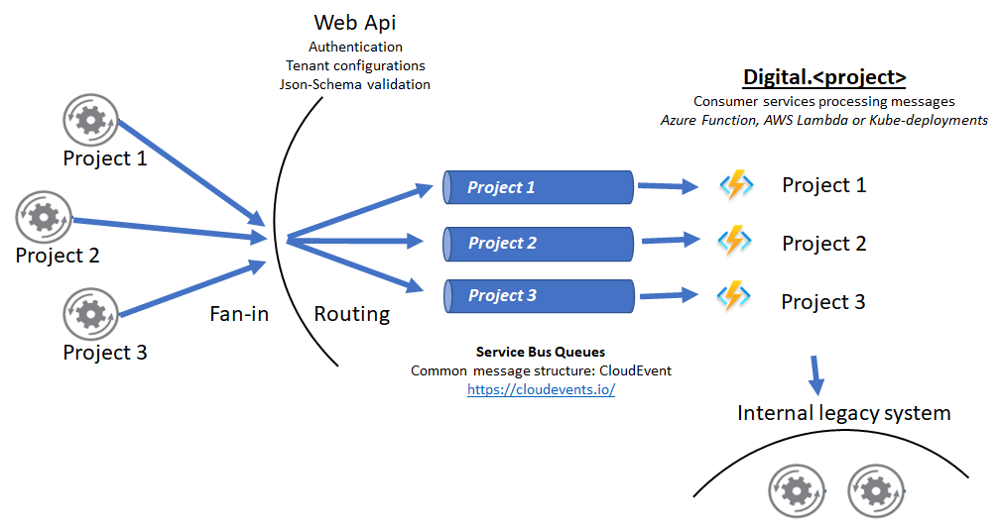

# Evento.Api
  

Multitenant Distributed architecture for processing transactions with resiliency to failures, scalability, fast onboarding of new projects.  
  

Scaled over tenants and projects using the same single Api entry point. Each CloudEvent message can be validated over different schemas
  

More details here http://www.dinuzzo.co.uk/2019/02/16/distributed-architecture-01-the-ingestion/ 